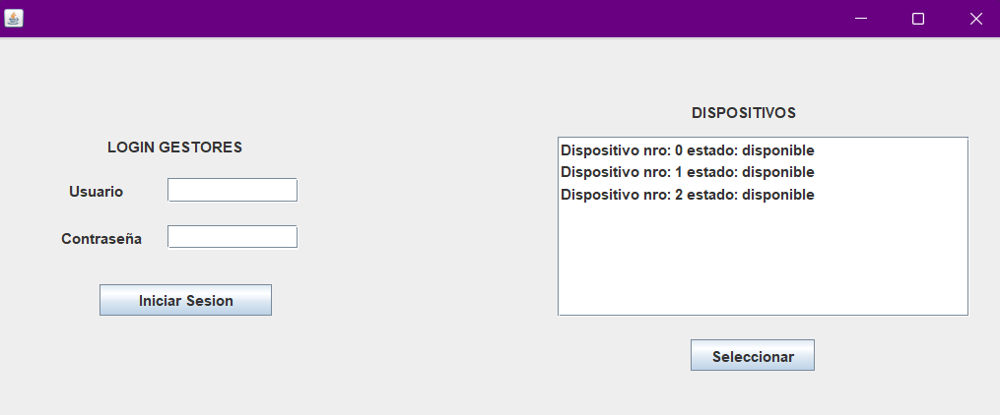
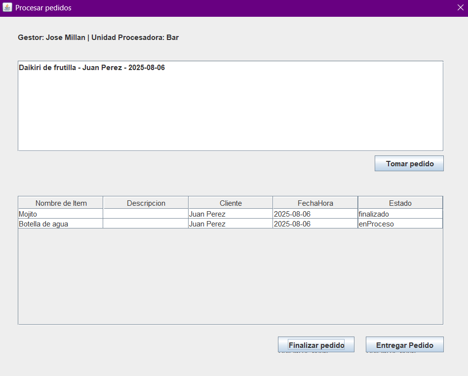
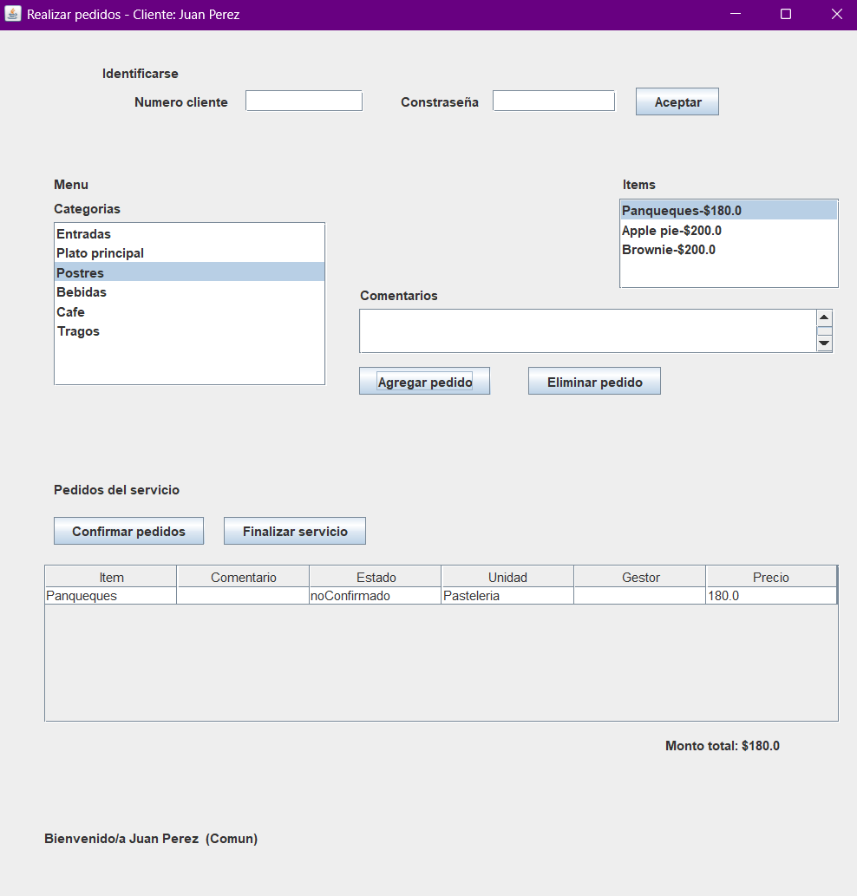

# Sistema de Gestión de Pedidos

  

Proyecto académico de aplicación de escritorio desarrollada en Java con GUI Swing y arquitectura MVC, que simula el sistema de pedidos para un restaurante.

Esta solución emula el uso de múltiples dispositivos en un restaurante, permitiendo la interacción simultánea de clientes y gestores desde distintas ventanas.

---

## 🧩 Funcionalidades principales

- **Login de clientes y gestores** (un solo dispositivo o sesión activa por usuario)  
- **Clientes**:  
  - Navegar el menú organizado por categorías  
  - Agregar y eliminar pedidos con comentarios personalizados  
  - Confirmar pedidos y servicios múltiples veces  
  - Pagar y finalizar el servicio, aplicando descuentos según tipo de cliente  
- **Gestores**:  
  - Visualizar pedidos pendientes en su unidad procesadora  
  - Tomar, finalizar y marcar pedidos como entregados  
- **Actualización automática** entre todas las ventanas abiertas para reflejar el estado real de pedidos y dispositivos  
- Gestión de **estados de dispositivos y pedidos** para control efectivo  

---

## ⚙️ Tecnologías y herramientas

- **Lenguaje:** Java  
- **IDE:** NetBeans  
- **Librerías gráficas:** Swing  
- **Patrones y principios aplicados:**  
  - Modelo-Vista-Controlador (MVC)  
  - Fachada  
  - Principio de Experto
  - Patrón Strategy
  - Observer
  - División lógica
  - Polimorfismo  
  - Manejo estructurado de excepciones  

---
## 🖼️ Capturas de pantalla

### Interfaz de Login de gestor y dispositivos para clientes

### Interfaz de gestor

### Interfaz de cliente

---

## 📄 Diagramas y documentación

- Diagramas de clases conceptuales y de diseño disponibles en la carpeta `docs/`
  
---

Martina Cuello – 2025
